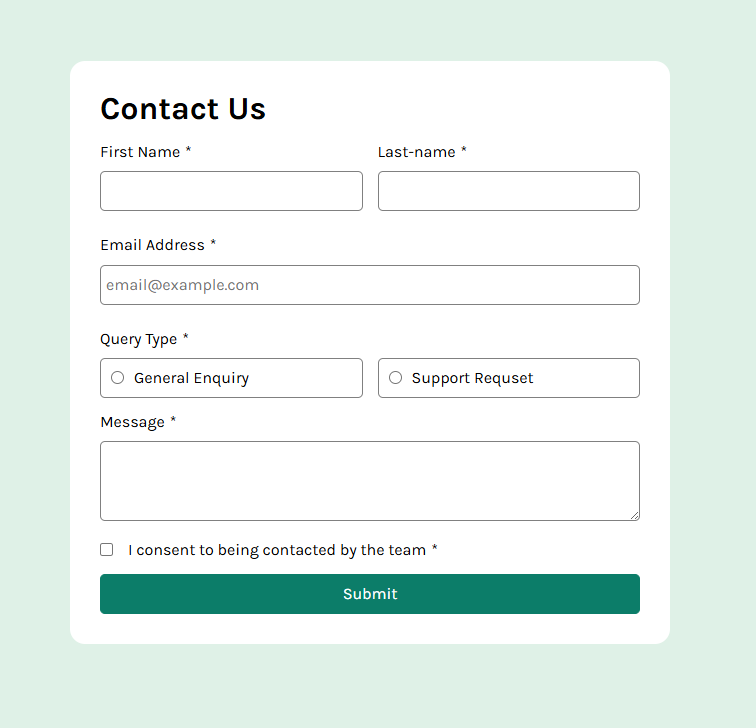

# Frontend Mentor - Contact form solution

This is a solution to the [Contact form challenge on Frontend Mentor](https://www.frontendmentor.io/challenges/contact-form--G-hYlqKJj). Frontend Mentor challenges help you improve your coding skills by building realistic projects.

## Table of contents

- [Overview](#overview)
  - [The challenge](#the-challenge)
  - [Screenshot](#screenshot)
  - [Links](#links)
- [My process](#my-process)
  - [Built with](#built-with)
  - [What I learned](#what-i-learned)
  - [Continued development](#continued-development)
  - [Useful resources](#useful-resources)
- [Author](#author)
- [Acknowledgments](#acknowledgments)

**Note: Delete this note and update the table of contents based on what sections you keep.**

## Overview

### The challenge

Users should be able to:

- Complete the form and see a success toast message upon successful submission
- Receive form validation messages if:
  - A required field has been missed
  - The email address is not formatted correctly
- Complete the form only using their keyboard
- Have inputs, error messages, and the success message announced on their screen reader
- View the optimal layout for the interface depending on their device's screen size
- See hover and focus states for all interactive elements on the page

### Screenshot

**Note: Delete this note and the paragraphs above when you add your screenshot. If you prefer not to add a screenshot, feel free to remove this entire section.**

### Links

- Solution URL: [Add solution URL here](https://your-solution-url.com)
- Live Site URL: [Add live site URL here](https://your-live-site-url.com)

## My process

### Built with

- Semantic HTML5 markup
- CSS custom properties
- Flexbox

**Note: These are just examples. Delete this note and replace the list above with your own choices**

### What I learned

checkValidity() 라는게 있는 줄 몰라서 삽질을 많이 했다..
값의 변화를 어쨋거나 감지하니까 change 이벤트를 붙여서 value가 false가 되면 에러메세지에 클래스를 붙여서 어쩌구 저쩌구... 언제나 더 나은 방법이 있더라. 별거아닌거같은데 빙빙둘러간 느낌이 큰듯..

form 전체 validity 체크 후 문제가 있는 필드가 있으면 에러메세지를 출력하고 버튼에 css에서 만들어 둔 애니메이션을 적용
이때 버튼을 다시 눌렀을때도 계속 애니메이션이 작동하게 하고싶었는데 classList.add("shake") 와 같은 방식으로 적용한 클래스를 제거하고 다시 붙이는 방법을 찾아봤다.

https://developer.mozilla.org/ko/docs/Web/API/Window/requestAnimationFrame

claude는 void submitBTN.offsetWidth; 로 리플로우를 강제하는 방식을 알려줬는데 렌더링파이프라인을 다시 가동하는건 좋지 않은거 같아서 다른 방법을 찾았다. 렌더링 파이프라인(style->layout->paint)
Gemini는 requestAnimationFrame()을 중첩해 이벤트루프와 렌더링파이프라인의 스케줄링 차이를 이용한 트릭을 적용.

rAF사용시 이 코드에서 remove Class -> rAF callback -> Style 계산(layout->paint->출력)
이렇게되면 rAF가 다음 프레임의 paint직전에 실행되나 remove -> add가 너무 빨리 연속되면 한 프레임 안에서의 변화로 인식해 작동하지 않을 수 있음

하지만 rAf를 중첩하면

submitBTN.classList.remove("shake"); // 1. 클래스 제거 (큐에 대기)

requestAnimationFrame(() => {
// 2. 첫 번째 rAF: 브라우저가 '클래스가 제거된 상태'를 인지하고
// 첫 번째 프레임의 렌더링 준비를 마친 시점.

requestAnimationFrame(() => {
// 3. 두 번째 rAF: 첫 번째 프레임의 Paint가 확실히 예약되거나 끝난 뒤,
// '다음(두 번째) 프레임' 직전에 실행됨.
submitBTN.classList.add("shake"); // 4. 이제서야 클래스 추가
});
});
브라우저 스케줄을 중시하나 미세한 타이밍 차이로 끊겨보일 수 있고 코드가 지저분해 질 수 있다

--> 결론: 그냥 JS로 애니메이션 넣어서 써라..

..모바일 대응하는거 깜빡했다... 다음에 하자..

### Useful resources

- https://developer.mozilla.org/ko/docs/Web/API/Element/tagName
- https://developer.mozilla.org/ko/docs/Web/CSS/Guides/Animations/Using
- https://developer.mozilla.org/ko/docs/Web/API/Window/requestAnimationFrame
- https://developer.mozilla.org/en-US/docs/Web/API/Element/ariaDescribedByElements

**Note: Delete this note and replace the list above with resources that helped you during the challenge. These could come in handy for anyone viewing your solution or for yourself when you look back on this project in the future.**

## Author

- Website - [Add your name here](https://www.your-site.com)
- Frontend Mentor - [@yourusername](https://www.frontendmentor.io/profile/yourusername)
- Twitter - [@yourusername](https://www.twitter.com/yourusername)

**Note: Delete this note and add/remove/edit lines above based on what links you'd like to share.**

## Acknowledgments

This is where you can give a hat tip to anyone who helped you out on this project. Perhaps you worked in a team or got some inspiration from someone else's solution. This is the perfect place to give them some credit.

**Note: Delete this note and edit this section's content as necessary. If you completed this challenge by yourself, feel free to delete this section entirely.**
